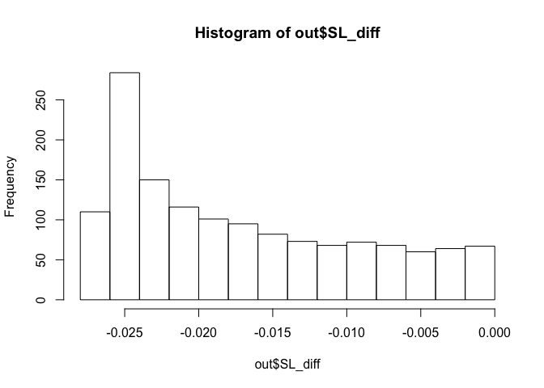

[](http://www.repostatus.org/#active)
[](http://opensource.org/licenses/MIT)
[](https://doi.org/10.1016/j.jbi.2020.103474)

This paper proposed a three-stage modular design for estimating the
treatment effect heterogeneity in observational survival analysis. The
method provides monotonic survival curves with adjustment for selection
and censoring bias. We automate the identification of features
contributing to the effect heterogeneity. We avoid the ad-hoc subgroup
selection by non-parametrically estimating the conditional treatment
effect. We provide evidence that oral anticoagulants confer protection
against stroke and death on newly diagnosed non-valvular atrial
fibrillation patients.

``` r
require(dplyr)
require(MOSS) #devtools::install_github('wilsoncai1992/MOSS')
require(survival)
#require(simcausal) #if you want complicate simulation, please install from local directory install.packages("~/simcausal_0.5.5.tar", repos = NULL)
require(abind)
require(tidyverse)
```

Generate some sample

``` r
n <- 100
W <- data.frame(W1 = runif(n), W2 = rbinom(n, 1, 0.5))
A <- rbinom(n, 1, 0.5)
EventTime <- rgeom(n,plogis(-4 + W$W1 * W$W2 - A)) + 1
CensorTime <- rgeom(n, plogis(-6 + W$W1)) + 1
T.tilde <- pmin(EventTime, CensorTime)
Delta <- as.numeric(T.tilde == EventTime)
df = data.frame(A = A, T.tilde = T.tilde, Delta = Delta, W1 = W$W1, W2=W$W2)
df$ID <- seq.int(nrow(df))
max_time = 30
head(df)
```

    ##   A T.tilde Delta         W1 W2 ID
    ## 1 0      31     1 0.04124854  0  1
    ## 2 0       2     0 0.72005783  1  2
    ## 3 0      76     1 0.47270835  0  3
    ## 4 1      40     0 0.50742676  0  4
    ## 5 0      12     1 0.53807847  0  5
    ## 6 0      13     0 0.22760599  0  6

Run the method proposed in the step 1 and 2 of paper

``` r
  df <- df[df$T.tilde<= max_time & df$T.tilde>0,]
  df <- df[complete.cases(df),]


  adjustVars <- grep('W', colnames(df), value = T)
  sl_lib_g <- c( "SL.earth","SL.gam") #choose your own esemble algorithm here 
  sl_lib_censor <- c( "SL.earth","SL.gam")
  sl_lib_failure <- c( "SL.earth","SL.gam")

  #df$T.tilde <- df$T.tilde + 1
  k_grid <- 1:max(df$T.tilde)

  #SL
  sl_fit <- initial_sl_fit(
    T_tilde = df$T.tilde,
    Delta = df$Delta,
    A = df$A,
    W = data.frame(df[, adjustVars]),
    #adjustVars = df[,c('W','W1')],
    t_max = max(df$T.tilde),
    sl_treatment = sl_lib_g,
    sl_censoring = sl_lib_censor,
    sl_failure = sl_lib_failure
  )


  sl_fit$density_failure_1$hazard_to_survival()
```

    ## <survival_curve>
    ##   Public:
    ##     ci: function (A, T_tilde, Delta, density_failure, density_censor, 
    ##     clone: function (deep = FALSE) 
    ##     create_ggplot_df: function (W = NULL) 
    ##     display: function (type, W = NULL) 
    ##     hazard: 0.04827380765544 0.0226732534117789 0.0264632731766024 0 ...
    ##     hazard_to_pdf: function () 
    ##     hazard_to_survival: function () 
    ##     initialize: function (t, hazard = NULL, survival = NULL, pdf = NULL) 
    ##     n: function () 
    ##     pdf: NULL
    ##     pdf_to_hazard: function () 
    ##     pdf_to_survival: function () 
    ##     survival: 1 1 1 1 1 1 1 1 1 1 1 1 1 1 1 1 1 1 1 1 1 1 1 1 1 1 1 1  ...
    ##     survival_to_hazard: function () 
    ##     survival_to_pdf: function () 
    ##     t: 1 2 3 4 5 6 7 8 9 10 11 12 13 14 15 16 17 18 19 20 21 22 ...

``` r
  sl_fit$density_failure_0$hazard_to_survival()
```

    ## <survival_curve>
    ##   Public:
    ##     ci: function (A, T_tilde, Delta, density_failure, density_censor, 
    ##     clone: function (deep = FALSE) 
    ##     create_ggplot_df: function (W = NULL) 
    ##     display: function (type, W = NULL) 
    ##     hazard: 0.0450044757864713 0.0210992755922479 0.0246328234202494 ...
    ##     hazard_to_pdf: function () 
    ##     hazard_to_survival: function () 
    ##     initialize: function (t, hazard = NULL, survival = NULL, pdf = NULL) 
    ##     n: function () 
    ##     pdf: NULL
    ##     pdf_to_hazard: function () 
    ##     pdf_to_survival: function () 
    ##     survival: 1 1 1 1 1 1 1 1 1 1 1 1 1 1 1 1 1 1 1 1 1 1 1 1 1 1 1 1  ...
    ##     survival_to_hazard: function () 
    ##     survival_to_pdf: function () 
    ##     t: 1 2 3 4 5 6 7 8 9 10 11 12 13 14 15 16 17 18 19 20 21 22 ...

``` r
  sl_fit$density_failure_1$t <- k_grid
  sl_fit$density_failure_0$t <- k_grid

  sl_density_failure_1_marginal <- sl_fit$density_failure_1$clone(deep = TRUE)
  sl_density_failure_0_marginal <- sl_fit$density_failure_0$clone(deep = TRUE)
  sl_density_failure_1_marginal$survival <- matrix(colMeans(sl_density_failure_1_marginal$survival), nrow = 1)
  sl_density_failure_0_marginal$survival <- matrix(colMeans(sl_density_failure_0_marginal$survival), nrow = 1)


  out <- list(sl_fit_1 = sl_fit$density_failure_1$survival,
              sl_fit_0 = sl_fit$density_failure_0$survival,
              SL_diff = sl_fit$density_failure_1$survival-sl_fit$density_failure_0$survival)
```

Individual difference in survival probabilities

``` r
head(out$SL_diff)
```

    ##      [,1]         [,2]         [,3]         [,4]         [,5]         [,6]
    ## [1,]    0 -0.003269332 -0.006363846 -0.009270382 -0.011976896 -0.014471242
    ## [2,]    0 -0.001573978 -0.003149072 -0.004721138 -0.006286001 -0.007838636
    ## [3,]    0 -0.001830450 -0.003647504 -0.005445407 -0.007218389 -0.008959749
    ## [4,]    0 -0.002332201 -0.004610313 -0.006825377 -0.008968579 -0.011030201
    ## [5,]    0 -0.003780963 -0.007295848 -0.010531518 -0.013476895 -0.016121671
    ## [6,]    0 -0.001912512 -0.003806092 -0.005674457 -0.007511319 -0.009309449
    ##              [,7]        [,8]        [,9]       [,10]       [,11]       [,12]
    ## [1,] -0.016741584 -0.01877629 -0.02056515 -0.02210062 -0.02338091 -0.02440952
    ## [2,] -0.009373092 -0.01088193 -0.01235639 -0.01378665 -0.01516458 -0.01648470
    ## [3,] -0.010661824 -0.01231544 -0.01391019 -0.01543489 -0.01688052 -0.01824113
    ## [4,] -0.012999699 -0.01486526 -0.01661439 -0.01823467 -0.01971700 -0.02105616
    ## [5,] -0.018456906 -0.02047513 -0.02217183 -0.02354684 -0.02460693 -0.02536455
    ## [6,] -0.011060657 -0.01275525 -0.01438238 -0.01593051 -0.01739043 -0.01875616
    ##            [,13]       [,14]       [,15]       [,16]       [,17]       [,18]
    ## [1,] -0.02519327 -0.02573986 -0.02605537 -0.02614204 -0.02599694 -0.02561155
    ## [2,] -0.01774429 -0.01894279 -0.02008113 -0.02115981 -0.02217783 -0.02313065
    ## [3,] -0.01951369 -0.02069727 -0.02179198 -0.02279683 -0.02370844 -0.02451885
    ## [4,] -0.02225018 -0.02329884 -0.02420212 -0.02495764 -0.02555925 -0.02599495
    ## [5,] -0.02583512 -0.02603406 -0.02597416 -0.02566369 -0.02510559 -0.02429806
    ## [6,] -0.02002470 -0.02119506 -0.02226721 -0.02323977 -0.02410871 -0.02486514
    ##            [,19]       [,20]       [,21]       [,22]       [,23]       [,24]
    ## [1,] -0.02497230 -0.02406209 -0.02286308 -0.02136129 -0.01955409 -0.01746002
    ## [2,] -0.02400844 -0.02479449 -0.02546308 -0.02597739 -0.02628774 -0.02633159
    ## [3,] -0.02521385 -0.02577151 -0.02616041 -0.02633841 -0.02625236 -0.02584070
    ## [4,] -0.02624583 -0.02628521 -0.02607840 -0.02558360 -0.02475514 -0.02355054
    ## [5,] -0.02323618 -0.02191445 -0.02033079 -0.01849186 -0.01642066 -0.01416461
    ## [6,] -0.02549373 -0.02597123 -0.02626499 -0.02633196 -0.02611902 -0.02556633
    ##            [,25]        [,26]        [,27]        [,28]        [,29]
    ## [1,] -0.01512736 -0.012639590 -0.010113776 -0.007690128 -0.005510177
    ## [2,] -0.02603678 -0.025328352 -0.024140094 -0.022431456 -0.020207760
    ## [3,] -0.02503956 -0.023792921 -0.022066804 -0.019867025 -0.017255893
    ## [4,] -0.02194067 -0.019922653 -0.017533189 -0.014859675 -0.012042000
    ## [5,] -0.01179958 -0.009428544 -0.007171858 -0.005150101 -0.003460738
    ## [6,] -0.02461433 -0.023214700 -0.021344956 -0.019025793 -0.016335875
    ##             [,30]
    ## [1,] -0.003687888
    ## [2,] -0.017537589
    ## [3,] -0.014360165
    ## [4,] -0.009258803
    ## [5,] -0.002156301
    ## [6,] -0.013416216

``` r
hist(out$SL_diff)
```

 The
average on the ITEs will be the TMLE adjusted ATE.

``` r
#ATE
mean(out$SL_diff)
```

    ## [1] -0.01706689

Please refer to the paper for BART variable importance measure and
kernal grouping to get the CATE for subgroups.
